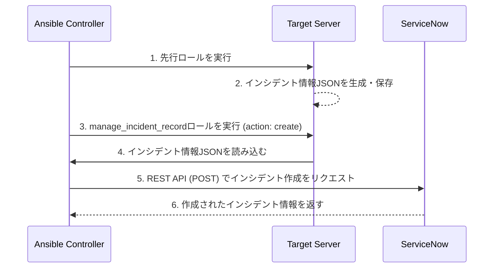

# ServiceNow Manage Incident Record

ServiceNOW上のインシデントテーブルにインシデントレコードを作成・変更・削除するためのロールです。

## 概要

このロールは、`record_action`変数に指定された値に応じて、以下の処理を行います。

- **create**: 新しいインシデントレコードを作成します。
  - リモートサーバー上の所定のJSONファイルからインシデント詳細を読み込み、ServiceNOWのインシデントテーブルに新しいレコードを作成します。
  - インシデント詳細は、テンプレートファイル`./templates/incident_ticket.j2`を使用して構築されます。
- **update**: 既存のインシデントレコードを更新します。
  - `incident_sys_id`変数で更新対象のインシデントを指定します。
  - 更新したい変数のみを指定して実行できます。すべての変数を指定する必要はありません。
- **delete**: 既存のインシデントレコードを削除します。
  - `incident_sys_id`変数で削除対象のインシデントを指定します。

### 処理の流れ
1. インシデント詳細の情報をターゲットサーバー上の所定のJSONファイル(変数名:`remote_filepath_incident_description`)から読み込み、変数として設定します。
2. `record_action`の値に応じて、ServiceNOWのインシデントテーブルに対してレコードの作成、更新、または削除を実行します。

## 想定する使い方

このロールは、他のAnsibleロールと連携し、複数のターゲットサーバーにまたがってインシデントを管理することを想定しています。

想定するフローは以下の通りです：
1. **先行ロールの実行**: 先行する別のAnsibleロール（例: 監視、診断、アプリケーションデプロイなど）がターゲットサーバー上で実行されます。
2. **インシデント情報の生成**: 先行ロールはその実行結果や検出した問題（例: サービス停止、設定不備）に基づき、インシデント情報をJSONファイルとしてターゲットサーバー上に保存します。このJSONファイルは、`incident_ticket.j2`を具体化したものです。
3. **本ロールの実行**: `manage_incident_record`ロールが実行され、ターゲットサーバー上に保存されたJSONファイル（`remote_filepath_incident_description`でパスを指定）を読み込みます。
4. **ServiceNowとの連携**: 読み込んだ情報を使って、ServiceNowにインシデントを起票（作成・更新・削除）します。

これにより、各サーバー固有の状況に基づいたインシデント管理を自動化できます。

### シーケンスの一例: インシデント作成



## 前提条件

- インシデント詳細ファイルと`incident_ticket.j2`が一対一になっている
  - `incident_ticket.j2`のキー名とインシデントテーブルのフィールド名は一致している必要があります

## 要件

- ServiceNOWインスタンスへのアクセス権限
- ServiceNOWのユーザー名とパスワード
- `ansible.builtin.uri`モジュールの使用

## ロール変数

### 必須変数

- `servicenow_user`: ServiceNOWのユーザー名
- `servicenow_password`: ServiceNOWのパスワード
- `servicenow_instance_url`: ServiceNOWのインスタンスURL
- `remote_filepath_incident_description`: インシデント詳細の情報が格納されたリモートサーバー上のJSONファイルへのパス（例: `"/tmp/sample_incident_description.json"`）
- `record_action`: 実行する操作。`create`, `update`, `delete`のいずれかを指定します。
- `incident_sys_id`: `update`または`delete`アクションの対象となるインシデントの`sys_id`。`record_action`が`update`または`delete`の場合に必須です。

### デフォルト変数

以下の変数はデフォルト値が設定されていますが、必要に応じて上書きできます:

- `short_description`: インシデントの簡潔な説明（デフォルト: `""`）
- `description`: インシデントの詳細な説明（デフォルト: `""`）
- `category`: インシデントのカテゴリ（デフォルト: `"Inquiry/Help"`）
- `impact_as_integer`: 影響度（1: 高, 2: 中, 3: 低）（デフォルト: `3`）
- `urgency_as_integer`: 緊急度（1: 高, 2: 中, 3: 低）（デフォルト: `3`）
- `state_as_integer`: 状態（1: 新規, 2: 進行中, 3: 保留中, 4: 解決済み, 5: 終了, 6: キャンセル）（デフォルト: `1`）


**参考: インシデントの管理(ServiceNOW)**:
- https://www.servicenow.com/docs/ja-JP/bundle/yokohama-it-service-management/page/product/incident-management/concept/incident-configuration.html


### インシデント詳細に関する変数
テンプレートファイル`./templates/incident_ticket.j2`を参照してください。

## 依存関係
このロールには依存関係はありません。

## 使用例

### インシデントの作成
```yaml
# use with --vault-password-file .vault_pass.txt or --ask-vault-pass
---
- hosts: localhost
  gather_facts: no
  roles:
    - role: servicenow/manage_incident_record
      vars:
        record_action: "create"
```

### インシデントの更新
```yaml
# use with --vault-password-file .vault_pass.txt or --ask-vault-pass
---
- hosts: localhost
  gather_facts: no
  roles:
    - role: servicenow/manage_incident_record
      vars:
        record_action: "update"
        incident_sys_id: "your_incident_sys_id"
        short_description: "Updated short description"
        # (その他の更新したい変数をここに記述)
```
**Note:** 更新処理は`PATCH`リクエストを使用しているため、`incident_sys_id`と更新したい変数のみを指定して実行できます。すべての変数を指定する必要はありません。


### インシデントの削除
```yaml
# use with --vault-password-file .vault_pass.txt or --ask-vault-pass
---
- hosts: localhost
  gather_facts: no
  roles:
    - role: servicenow/manage_incident_record
      vars:
        record_action: "delete"
        incident_sys_id: "your_incident_sys_id"
```

## テスト
このロールには、`create`, `update`, `delete`アクションをテストするためのPlaybookが含まれています。

テストを実行するには、まず`tests/test_vars/servicenow_credentials.yml`にServiceNowの認証情報を設定してください。

```bash
# インシデント作成のテスト
ansible-playbook roles/servicenow/manage_incident_record/tests/test-create.yml -i roles/servicenow/manage_incident_record/tests/inventory --vault-password-file .vault_pass.txt

# インシデント更新のテスト
# NOTE: test-update.yml内の incident_sys_id を有効な値に置き換える必要があります
ansible-playbook roles/servicenow/manage_incident_record/tests/test-update.yml -i roles/servicenow/manage_incident_record/tests/inventory --vault-password-file .vault_pass.txt

# インシデント削除のテスト
# NOTE: test-delete.yml内の incident_sys_id を有効な値に置き換える必要があります
ansible-playbook roles/servicenow/manage_incident_record/tests/test-delete.yml -i roles/servicenow/manage_incident_record/tests/inventory --vault-password-file .vault_pass.txt
```

## ライセンス

MIT

## 作者情報

このロールはServiceNOWとの連携を簡素化するために作成されました。